# Deliverable 10-16: Architecture Diagrams
## Nelson Aczon License Broker & Appraiser Platform

**Document ID:** AD-001  
**Version:** 1.0  
**Status:** Draft  
**Last Updated:** 2026-07-22  
**Review Board:** Software Architecture, DevOps, Database Team  

---

## 1. Document Overview

### 1.1 Purpose
This document defines the architecture diagrams for the Nelson Aczon License Broker & Appraiser Platform. It includes system context, container, component, sequence, activity, and state diagrams.

### 1.2 Notation
- **C4 Model:** System, Container, Component, Code
- **UML:** Sequence, Activity, State
- **Mermaid:** Diagram syntax for documentation

---

## 2. System Context Diagram (Level 1)

### 2.1 Overview
The system context diagram shows the high-level system and its interactions with external actors and systems.

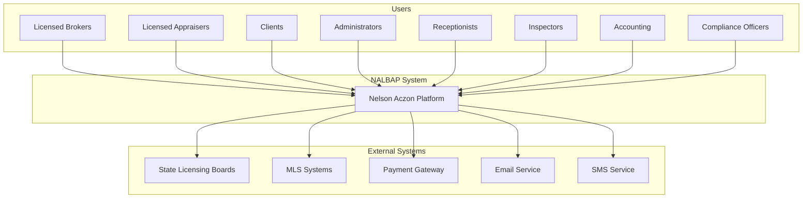

### 2.2 Context Description

| Actor/System | Description | Interface |
|--------------|-------------|-----------|
| **Licensed Brokers** | Manage licenses and agents | Web/Mobile App |
| **Licensed Appraisers** | Complete appraisal orders | Web/Mobile App |
| **Clients** | View reports and track orders | Web Portal |
| **Administrators** | Manage platform and users | Web App |
| **Receptionists** | Handle office operations | Web App |
| **Inspectors** | Complete property inspections | Mobile App |
| **Accounting** | Manage finances and invoicing | Web App |
| **Compliance Officers** | Monitor regulatory compliance | Web App |
| **State Licensing Boards** | License verification | REST API |
| **MLS Systems** | Property data | REST API |
| **Payment Gateway** | Transaction processing | REST API |
| **Email Service** | Notifications | SMTP/API |
| **SMS Service** | Alerts | REST API |

---

## 3. Container Diagram (Level 2)

### 3.1 Overview
The container diagram shows the high-level technical containers that make up the system.

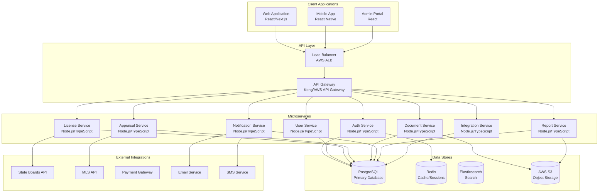

### 3.2 Container Description

| Container | Technology | Purpose | Scalability |
|-----------|------------|---------|-------------|
| **Web Application** | React/Next.js | Client-facing UI | Horizontal |
| **Mobile App** | React Native | Mobile access | Horizontal |
| **Admin Portal** | React | Administration | Horizontal |
| **API Gateway** | Kong/AWS | Request routing | Horizontal |
| **Load Balancer** | AWS ALB | Traffic distribution | Auto-scaling |
| **Auth Service** | Node.js/TypeScript | Authentication | Horizontal |
| **User Service** | Node.js/TypeScript | User management | Horizontal |
| **License Service** | Node.js/TypeScript | License management | Horizontal |
| **Appraisal Service** | Node.js/TypeScript | Appraisal workflow | Horizontal |
| **Document Service** | Node.js/TypeScript | Document management | Horizontal |
| **Notification Service** | Node.js/TypeScript | Notifications | Horizontal |
| **Report Service** | Node.js/TypeScript | Reporting | Horizontal |
| **Integration Service** | Node.js/TypeScript | External integrations | Horizontal |
| **PostgreSQL** | PostgreSQL 14+ | Primary database | Read replicas |
| **Redis** | Redis 7+ | Cache/sessions | Cluster mode |
| **Elasticsearch** | Elasticsearch 8+ | Search | Cluster mode |
| **S3** | AWS S3 | Object storage | Unlimited |

---

## 4. Component Diagram (Level 3)

### 4.1 License Service Components

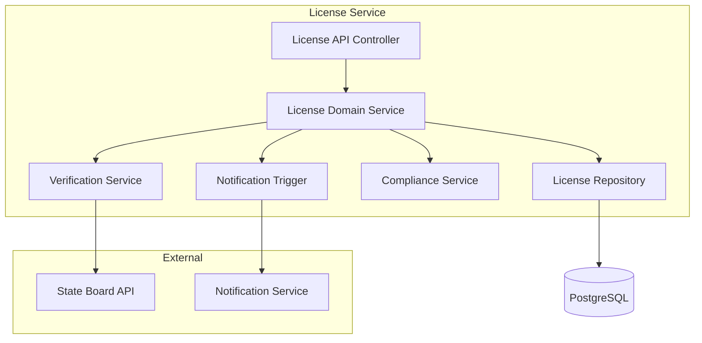

### 4.2 Appraisal Service Components

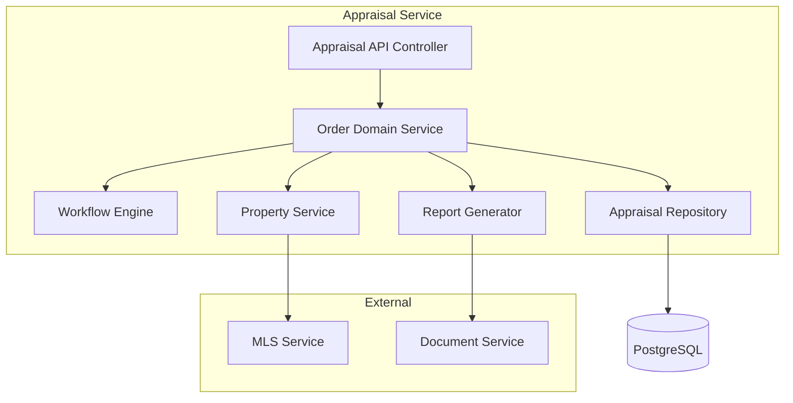

---

## 5. Sequence Diagrams

### 5.1 User Login Sequence

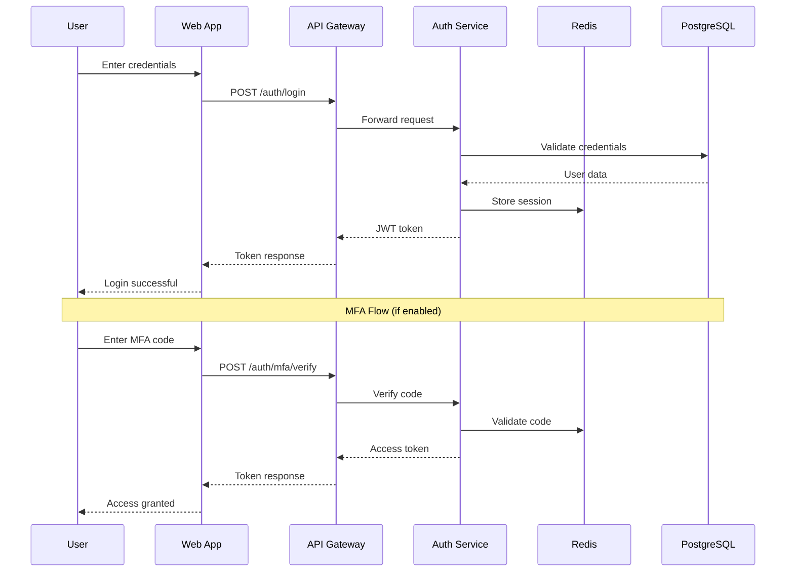

### 5.2 License Verification Sequence

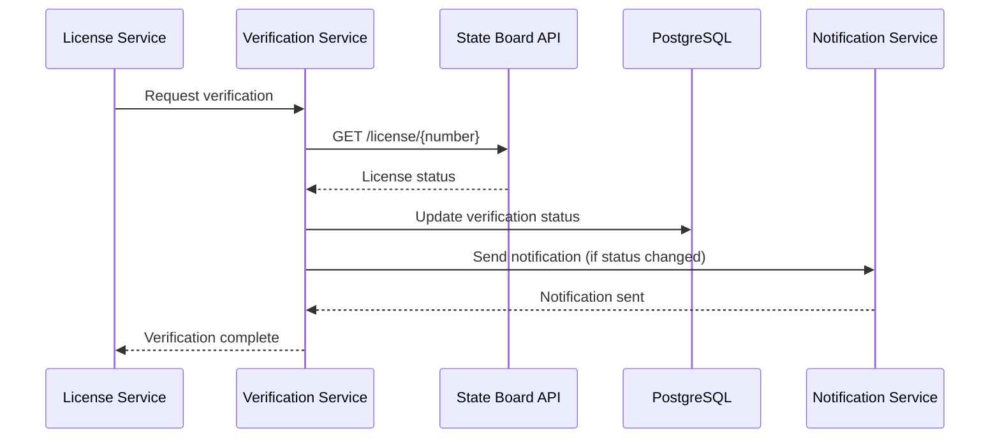

### 5.3 Appraisal Order Workflow Sequence

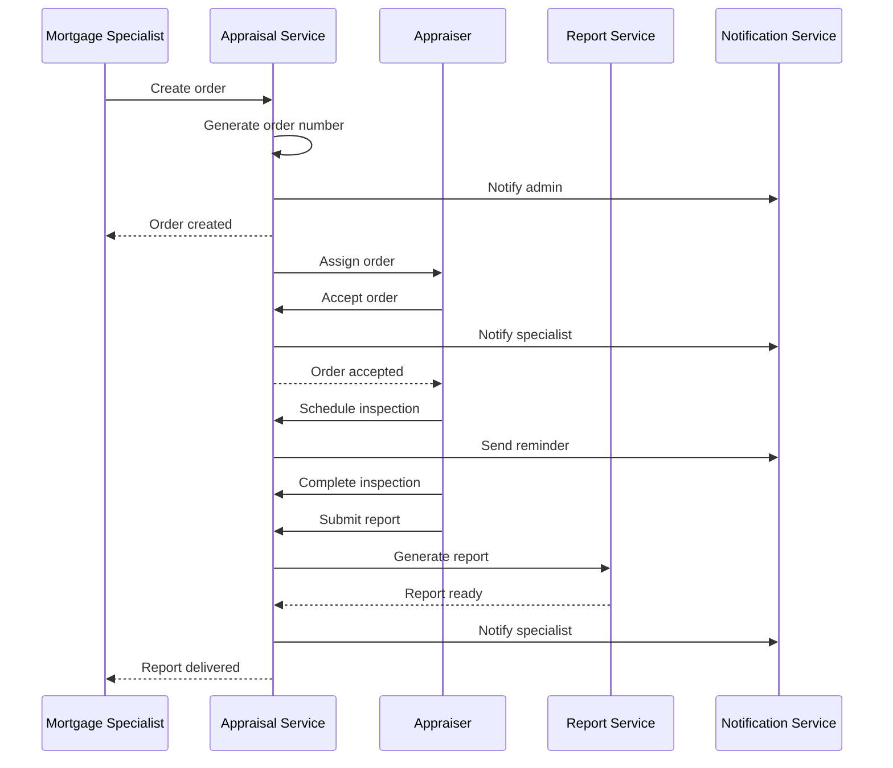

### 5.4 Document Upload Sequence

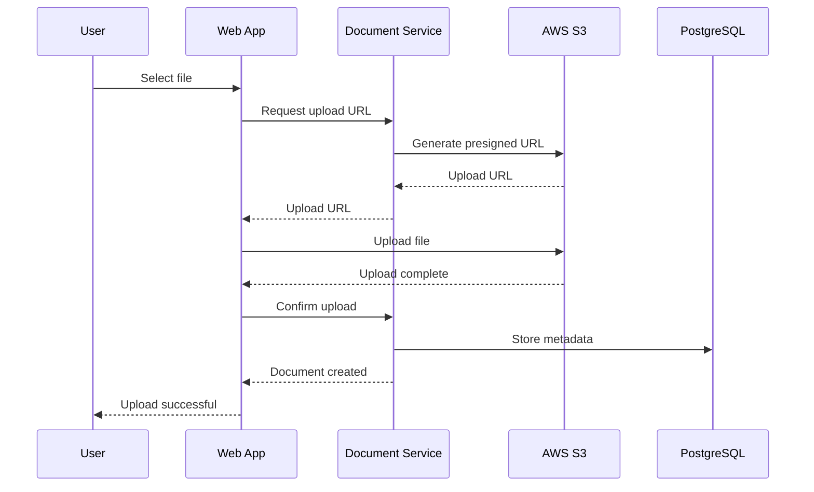

---

## 6. Activity Diagrams

### 6.1 License Renewal Process

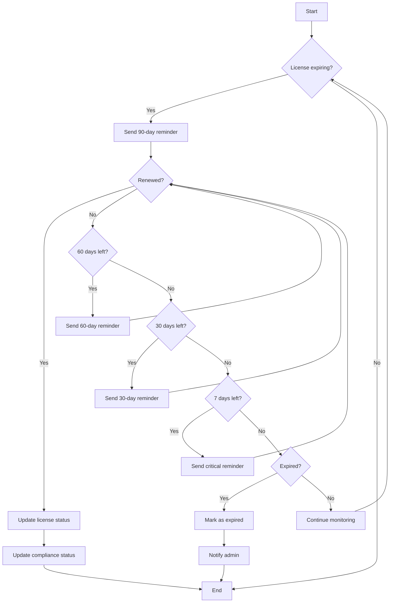

### 6.2 Appraisal Order Workflow

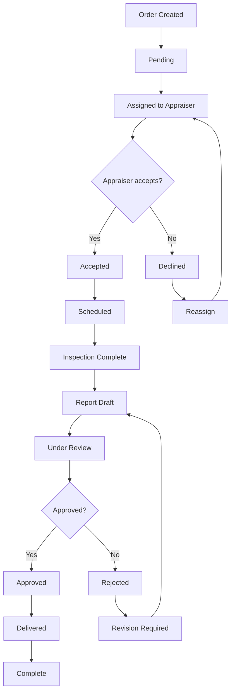

### 6.3 Document Management Flow

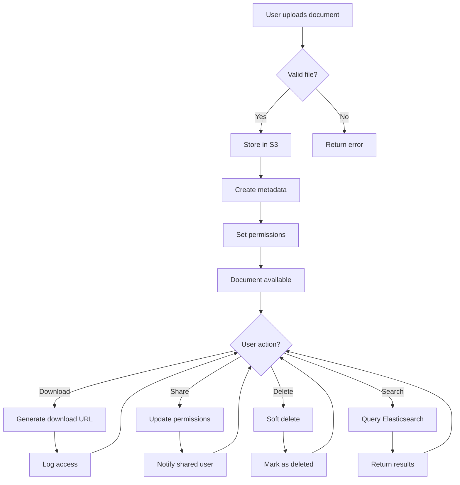

---

## 7. State Diagrams

### 7.1 License State Machine

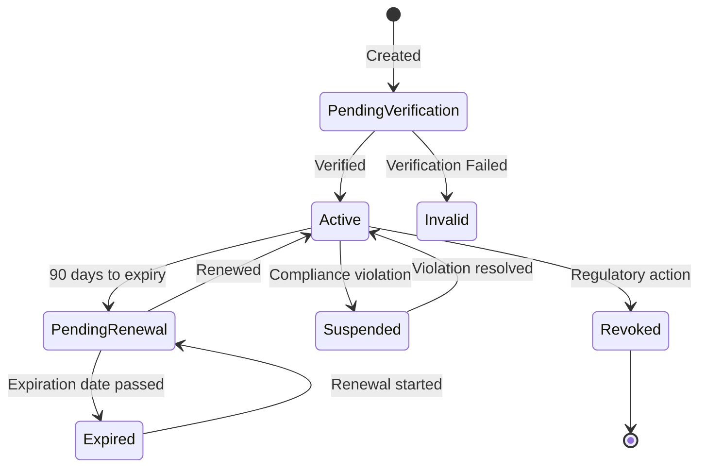

### 7.2 Appraisal Order State Machine

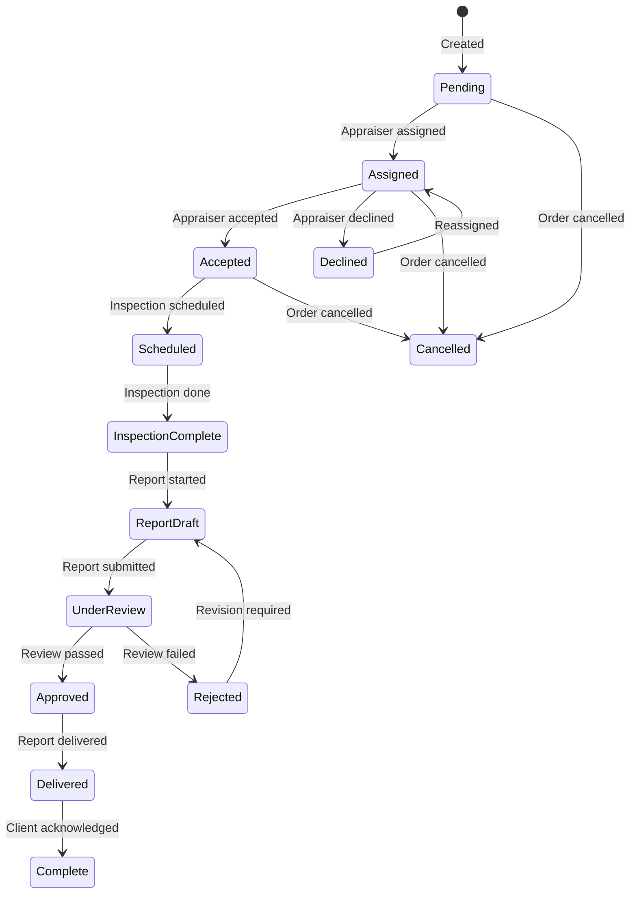

### 7.3 User Account State Machine

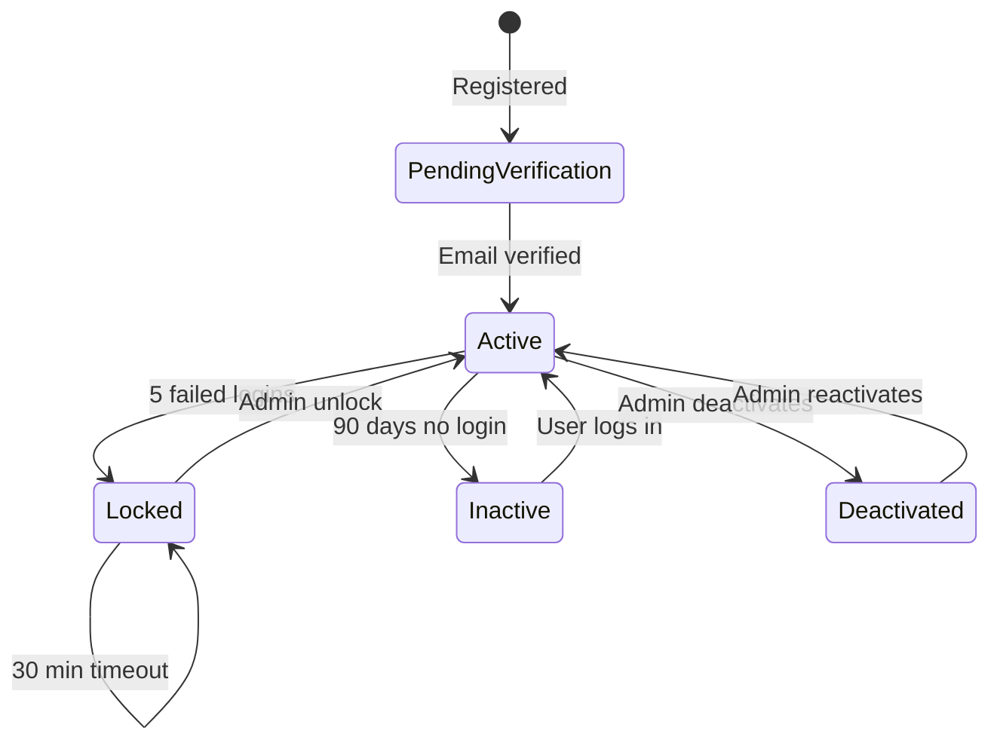

---

## 8. Deployment Diagram

### 8.1 AWS Deployment Architecture

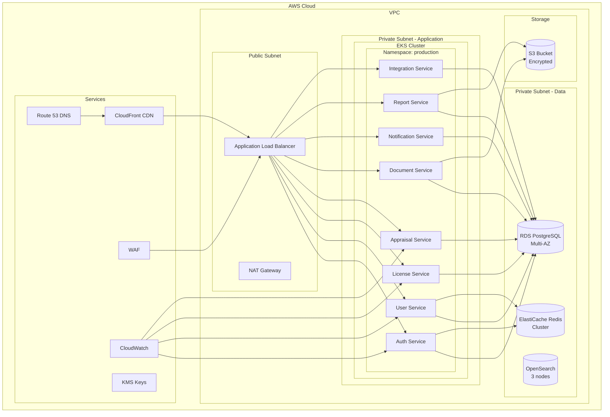

---

## 9. Architecture Decision Records

### 9.1 ADR-006: Microservices Architecture

**Decision:** Adopt microservices architecture for the platform.

**Context:**
- Multiple bounded contexts
- Different scalability requirements
- Team autonomy needed
- Technology flexibility required

**Consequences:**
+ Independent deployment
+ Technology flexibility
+ Team autonomy
+ Fine-grained scalability
- Increased complexity
- Network overhead
- Distributed transactions
- Operational overhead

**Status:** Accepted

### 9.2 ADR-007: Event-Driven Communication

**Decision:** Use event-driven architecture for inter-service communication.

**Context:**
- Async operations needed
- Decoupling required
- Audit trail important
- Real-time updates needed

**Consequences:**
+ Loose coupling
+ Scalability
+ Audit trail
+ Real-time updates
- Eventual consistency
- Complexity
- Debugging difficulty

**Status:** Accepted

### 9.3 ADR-008: Database per Service

**Decision:** Each microservice owns its data.

**Context:**
- Data isolation required
- Different data models
- Scalability needs
- Multi-tenant isolation

**Consequences:**
+ Data isolation
+ Independent scaling
+ Schema flexibility
+ Multi-tenant support
- Data consistency challenges
- Cross-service queries
- Data duplication

**Status:** Accepted

---

## 10. Review Board Assessment

### Software Architecture Review

| Reviewer | Status | Comments |
|----------|--------|----------|
| **Google Staff Engineer** | Pending | Scalability review |
| **Microsoft Principal Engineer** | Pending | Enterprise patterns |
| **Amazon Principal Engineer** | Pending | Cloud-native design |
| **Netflix Distributed Systems Engineer** | Pending | Resilience patterns |
| **Cloud Architect** | Pending | Infrastructure alignment |
| **Enterprise Architect** | Pending | Architecture governance |

### DevOps Team Review

| Reviewer | Status | Comments |
|----------|--------|----------|
| **Platform Engineer** | Pending | Platform design |
| **Kubernetes Engineer** | Pending | K8s architecture |
| **CI/CD Engineer** | Pending | Pipeline design |
| **SRE** | Pending | Reliability patterns |

---

## 11. Document History

| Version | Date | Author | Changes |
|---------|------|--------|---------|
| 1.0 | 2026-07-22 | System | Initial draft |

---

**Next Review:** API Specification (Deliverable 17)  
**Dependencies:** Domain Model, Non-Functional Requirements  
**Blockers:** Architecture Team validation required
