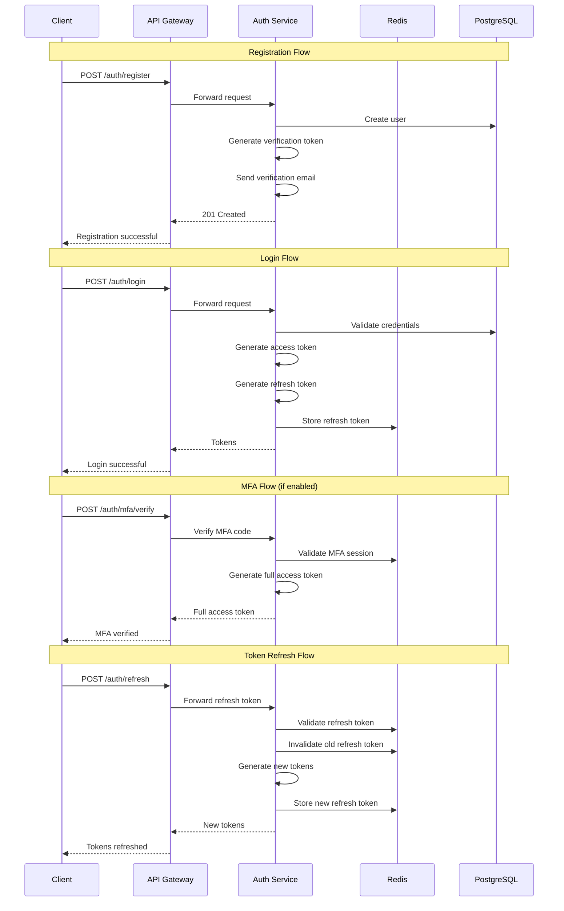
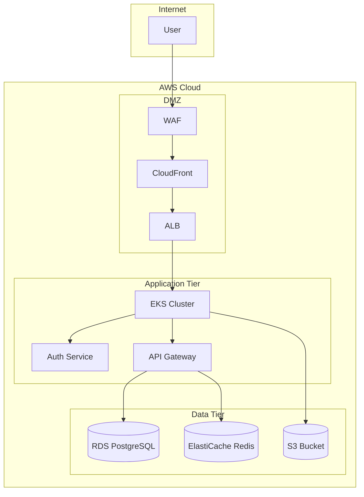

# Deliverable 17-20: API, Authentication, Authorization & Security
## Nelson Aczon License Broker & Appraiser Platform

**Document ID:** SEC-001  
**Version:** 1.0  
**Status:** Draft  
**Last Updated:** 2026-07-22  
**Review Board:** Software Architecture, Cybersecurity, Backend Engineering  

---

## 1. Document Overview

### 1.1 Purpose
This document defines the API specification, authentication design, authorization matrix (RBAC), and security threat model for the Nelson Aczon License Broker & Appraiser Platform.

### 1.2 Scope
- RESTful API Specification
- Authentication Design (JWT, MFA, SSO)
- Authorization Matrix (RBAC)
- Security Threat Model (OWASP Top 10)

---

## 2. API Specification (OpenAPI 3.0)

### 2.1 API Overview

| Property | Value |
|----------|-------|
| **Base URL** | https://api.nalbap.com/v1 |
| **Protocol** | HTTPS |
| **Format** | JSON |
| **Authentication** | Bearer Token (JWT) |
| **Rate Limiting** | 1000 requests/minute |
| **Versioning** | URL path (/v1, /v2) |

### 2.2 Authentication Endpoints

```yaml
openapi: 3.0.0
info:
  title: NALBAP API
  version: 1.0.0

paths:
  /auth/register:
    post:
      summary: Register new user
      tags: [Authentication]
      requestBody:
        required: true
        content:
          application/json:
            schema:
              type: object
              required: [email, password, firstName, lastName]
              properties:
                email:
                  type: string
                  format: email
                password:
                  type: string
                  minLength: 12
                firstName:
                  type: string
                lastName:
                  type: string
                tenantId:
                  type: string
                  format: uuid
      responses:
        '201':
          description: User registered
        '400':
          description: Validation error
        '409':
          description: Email already exists

  /auth/login:
    post:
      summary: User login
      tags: [Authentication]
      requestBody:
        required: true
        content:
          application/json:
            schema:
              type: object
              required: [email, password]
              properties:
                email:
                  type: string
                  format: email
                password:
                  type: string
      responses:
        '200':
          description: Login successful
          content:
            application/json:
              schema:
                type: object
                properties:
                  accessToken:
                    type: string
                  refreshToken:
                    type: string
                  expiresIn:
                    type: integer
                  user:
                    $ref: '#/components/schemas/User'
        '401':
          description: Invalid credentials
        '429':
          description: Too many attempts

  /auth/refresh:
    post:
      summary: Refresh access token
      tags: [Authentication]
      requestBody:
        required: true
        content:
          application/json:
            schema:
              type: object
              required: [refreshToken]
              properties:
                refreshToken:
                  type: string
      responses:
        '200':
          description: Token refreshed
        '401':
          description: Invalid refresh token

  /auth/logout:
    post:
      summary: User logout
      tags: [Authentication]
      security:
        - bearerAuth: []
      responses:
        '200':
          description: Logged out

  /auth/password/reset:
    post:
      summary: Request password reset
      tags: [Authentication]
      requestBody:
        required: true
        content:
          application/json:
            schema:
              type: object
              required: [email]
              properties:
                email:
                  type: string
                  format: email
      responses:
        '200':
          description: Reset email sent

  /auth/password/reset/confirm:
    post:
      summary: Confirm password reset
      tags: [Authentication]
      requestBody:
        required: true
        content:
          application/json:
            schema:
              type: object
              required: [token, newPassword]
              properties:
                token:
                  type: string
                newPassword:
                  type: string
                  minLength: 12
      responses:
        '200':
          description: Password reset
        '400':
          description: Invalid token

  /auth/mfa/enable:
    post:
      summary: Enable MFA
      tags: [Authentication]
      security:
        - bearerAuth: []
      responses:
        '200':
          description: MFA enabled
          content:
            application/json:
              schema:
                type: object
                properties:
                  secret:
                    type: string
                  qrCode:
                    type: string

  /auth/mfa/verify:
    post:
      summary: Verify MFA code
      tags: [Authentication]
      requestBody:
        required: true
        content:
          application/json:
            schema:
              type: object
              required: [code]
              properties:
                code:
                  type: string
                  minLength: 6
                  maxLength: 6
      responses:
        '200':
          description: MFA verified
        '401':
          description: Invalid code
```

### 2.3 User Endpoints

```yaml
paths:
  /users:
    get:
      summary: List users
      tags: [Users]
      security:
        - bearerAuth: []
      parameters:
        - name: page
          in: query
          schema:
            type: integer
            default: 1
        - name: limit
          in: query
          schema:
            type: integer
            default: 20
            maximum: 100
        - name: role
          in: query
          schema:
            type: string
            enum: [ADMIN, BROKER, APPRAISER, CLIENT, RECEPTIONIST, INSPECTOR, ACCOUNTING, COMPLIANCE_OFFICER]
      responses:
        '200':
          description: Users listed
        '403':
          description: Forbidden

  /users/{id}:
    get:
      summary: Get user by ID
      tags: [Users]
      security:
        - bearerAuth: []
      parameters:
        - name: id
          in: path
          required: true
          schema:
            type: string
            format: uuid
      responses:
        '200':
          description: User found
        '404':
          description: User not found
    put:
      summary: Update user
      tags: [Users]
      security:
        - bearerAuth: []
      parameters:
        - name: id
          in: path
          required: true
          schema:
            type: string
            format: uuid
      requestBody:
        required: true
        content:
          application/json:
            schema:
              $ref: '#/components/schemas/UserUpdate'
      responses:
        '200':
          description: User updated
        '403':
          description: Forbidden
    delete:
      summary: Delete user
      tags: [Users]
      security:
        - bearerAuth: []
      parameters:
        - name: id
          in: path
          required: true
          schema:
            type: string
            format: uuid
      responses:
        '200':
          description: User deleted
        '403':
          description: Forbidden
```

### 2.4 License Endpoints

```yaml
paths:
  /licenses:
    get:
      summary: List licenses
      tags: [Licenses]
      security:
        - bearerAuth: []
      parameters:
        - name: status
          in: query
          schema:
            type: string
            enum: [ACTIVE, EXPIRED, SUSPENDED, REVOKED, PENDING_RENEWAL]
        - name: type
          in: query
          schema:
            type: string
            enum: [BROKER, APPRAISER, SALESPERSON, INSPECTOR]
        - name: userId
          in: query
          schema:
            type: string
            format: uuid
      responses:
        '200':
          description: Licenses listed
    post:
      summary: Add license
      tags: [Licenses]
      security:
        - bearerAuth: []
      requestBody:
        required: true
        content:
          application/json:
            schema:
              $ref: '#/components/schemas/LicenseCreate'
      responses:
        '201':
          description: License added
        '400':
          description: Validation error
        '409':
          description: License already exists

  /licenses/{id}:
    get:
      summary: Get license by ID
      tags: [Licenses]
      security:
        - bearerAuth: []
      parameters:
        - name: id
          in: path
          required: true
          schema:
            type: string
            format: uuid
      responses:
        '200':
          description: License found
        '404':
          description: License not found
    put:
      summary: Update license
      tags: [Licenses]
      security:
        - bearerAuth: []
      parameters:
        - name: id
          in: path
          required: true
          schema:
            type: string
            format: uuid
      requestBody:
        required: true
        content:
          application/json:
            schema:
              $ref: '#/components/schemas/LicenseUpdate'
      responses:
        '200':
          description: License updated

  /licenses/{id}/verify:
    post:
      summary: Verify license
      tags: [Licenses]
      security:
        - bearerAuth: []
      parameters:
        - name: id
          in: path
          required: true
          schema:
            type: string
            format: uuid
      responses:
        '200':
          description: Verification started
        '400':
          description: Verification failed

  /licenses/{id}/renew:
    post:
      summary: Renew license
      tags: [Licenses]
      security:
        - bearerAuth: []
      parameters:
        - name: id
          in: path
          required: true
          schema:
            type: string
            format: uuid
      requestBody:
        required: true
        content:
          application/json:
            schema:
              type: object
              required: [newExpirationDate]
              properties:
                newExpirationDate:
                  type: string
                  format: date
      responses:
        '200':
          description: License renewed
```

### 2.5 Appraisal Order Endpoints

```yaml
paths:
  /appraisals/orders:
    get:
      summary: List appraisal orders
      tags: [Appraisals]
      security:
        - bearerAuth: []
      parameters:
        - name: status
          in: query
          schema:
            type: string
            enum: [PENDING, ASSIGNED, ACCEPTED, IN_PROGRESS, COMPLETED, CANCELLED]
        - name: assignedTo
          in: query
          schema:
            type: string
            format: uuid
        - name: priority
          in: query
          schema:
            type: string
            enum: [RUSH, STANDARD, ECONOMY]
      responses:
        '200':
          description: Orders listed
    post:
      summary: Create appraisal order
      tags: [Appraisals]
      security:
        - bearerAuth: []
      requestBody:
        required: true
        content:
          application/json:
            schema:
              $ref: '#/components/schemas/AppraisalOrderCreate'
      responses:
        '201':
          description: Order created

  /appraisals/orders/{id}:
    get:
      summary: Get order by ID
      tags: [Appraisals]
      security:
        - bearerAuth: []
      parameters:
        - name: id
          in: path
          required: true
          schema:
            type: string
            format: uuid
      responses:
        '200':
          description: Order found
    put:
      summary: Update order
      tags: [Appraisals]
      security:
        - bearerAuth: []
      parameters:
        - name: id
          in: path
          required: true
          schema:
            type: string
            format: uuid
      requestBody:
        required: true
        content:
          application/json:
            schema:
              $ref: '#/components/schemas/AppraisalOrderUpdate'
      responses:
        '200':
          description: Order updated

  /appraisals/orders/{id}/assign:
    post:
      summary: Assign appraiser to order
      tags: [Appraisals]
      security:
        - bearerAuth: []
      parameters:
        - name: id
          in: path
          required: true
          schema:
            type: string
            format: uuid
      requestBody:
        required: true
        content:
          application/json:
            schema:
              type: object
              required: [appraiserId]
              properties:
                appraiserId:
                  type: string
                  format: uuid
      responses:
        '200':
          description: Appraiser assigned

  /appraisals/orders/{id}/accept:
    post:
      summary: Accept order
      tags: [Appraisals]
      security:
        - bearerAuth: []
      parameters:
        - name: id
          in: path
          required: true
          schema:
            type: string
            format: uuid
      responses:
        '200':
          description: Order accepted

  /appraisals/orders/{id}/decline:
    post:
      summary: Decline order
      tags: [Appraisals]
      security:
        - bearerAuth: []
      parameters:
        - name: id
          in: path
          required: true
          schema:
            type: string
            format: uuid
      requestBody:
        required: true
        content:
          application/json:
            schema:
              type: object
              required: [reason]
              properties:
                reason:
                  type: string
      responses:
        '200':
          description: Order declined

  /appraisals/orders/{id}/complete:
    post:
      summary: Complete order
      tags: [Appraisals]
      security:
        - bearerAuth: []
      parameters:
        - name: id
          in: path
          required: true
          schema:
            type: string
            format: uuid
      responses:
        '200':
          description: Order completed
```

### 2.6 Document Endpoints

```yaml
paths:
  /documents:
    get:
      summary: List documents
      tags: [Documents]
      security:
        - bearerAuth: []
      parameters:
        - name: folderId
          in: query
          schema:
            type: string
            format: uuid
        - name: type
          in: query
          schema:
            type: string
      responses:
        '200':
          description: Documents listed
    post:
      summary: Upload document
      tags: [Documents]
      security:
        - bearerAuth: []
      requestBody:
        required: true
        content:
          multipart/form-data:
            schema:
              type: object
              required: [file, name]
              properties:
                file:
                  type: string
                  format: binary
                name:
                  type: string
                description:
                  type: string
                folderId:
                  type: string
                  format: uuid
                tags:
                  type: array
                  items:
                    type: string
      responses:
        '201':
          description: Document uploaded

  /documents/{id}:
    get:
      summary: Get document
      tags: [Documents]
      security:
        - bearerAuth: []
      parameters:
        - name: id
          in: path
          required: true
          schema:
            type: string
            format: uuid
      responses:
        '200':
          description: Document found
    delete:
      summary: Delete document
      tags: [Documents]
      security:
        - bearerAuth: []
      parameters:
        - name: id
          in: path
          required: true
          schema:
            type: string
            format: uuid
      responses:
        '200':
          description: Document deleted

  /documents/{id}/download:
    get:
      summary: Download document
      tags: [Documents]
      security:
        - bearerAuth: []
      parameters:
        - name: id
          in: path
          required: true
          schema:
            type: string
            format: uuid
      responses:
        '200':
          description: Document downloaded
          content:
            application/octet-stream:
              schema:
                type: string
                format: binary

  /documents/{id}/share:
    post:
      summary: Share document
      tags: [Documents]
      security:
        - bearerAuth: []
      parameters:
        - name: id
          in: path
          required: true
          schema:
            type: string
            format: uuid
      requestBody:
        required: true
        content:
          application/json:
            schema:
              type: object
              required: [userId, permission]
              properties:
                userId:
                  type: string
                  format: uuid
                permission:
                  type: string
                  enum: [READ, WRITE, ADMIN]
      responses:
        '200':
          description: Document shared
```

### 2.7 Report Endpoints

```yaml
paths:
  /reports:
    get:
      summary: List reports
      tags: [Reports]
      security:
        - bearerAuth: []
      parameters:
        - name: type
          in: query
          schema:
            type: string
            enum: [COMPLIANCE, FINANCIAL, ACTIVITY, AUDIT]
        - name: startDate
          in: query
          schema:
            type: string
            format: date
        - name: endDate
          in: query
          schema:
            type: string
            format: date
      responses:
        '200':
          description: Reports listed
    post:
      summary: Generate report
      tags: [Reports]
      security:
        - bearerAuth: []
      requestBody:
        required: true
        content:
          application/json:
            schema:
              type: object
              required: [type]
              properties:
                type:
                  type: string
                  enum: [COMPLIANCE, FINANCIAL, ACTIVITY, AUDIT]
                parameters:
                  type: object
                format:
                  type: string
                  enum: [PDF, CSV, EXCEL]
      responses:
        '200':
          description: Report generated

  /reports/{id}/download:
    get:
      summary: Download report
      tags: [Reports]
      security:
        - bearerAuth: []
      parameters:
        - name: id
          in: path
          required: true
          schema:
            type: string
            format: uuid
      responses:
        '200':
          description: Report downloaded
```

---

## 3. Authentication Design

### 3.1 JWT Token Structure

```json
{
  "header": {
    "alg": "RS256",
    "typ": "JWT",
    "kid": "key-id-2024-01"
  },
  "payload": {
    "sub": "user-uuid",
    "iss": "https://auth.nalbap.com",
    "aud": "https://api.nalbap.com",
    "exp": 1700000000,
    "iat": 1699996400,
    "jti": "unique-token-id",
    "tenant_id": "tenant-uuid",
    "role": "BROKER",
    "permissions": ["licenses:read", "licenses:write", "appraisals:read"]
  }
}
```

### 3.2 Token Lifecycle

| Token Type | Expiry | Refresh | Storage |
|------------|--------|---------|---------|
| **Access Token** | 15 minutes | No | Memory/HTTP-only cookie |
| **Refresh Token** | 7 days | Yes (rotation) | HTTP-only cookie |
| **MFA Token** | 5 minutes | No | Memory |
| **Reset Token** | 1 hour | No | Database |

### 3.3 Authentication Flow



### 3.4 MFA Implementation

| Method | Implementation | Backup |
|--------|----------------|--------|
| **TOTP** | Google Authenticator, Authy | Backup codes |
| **SMS** | Twilio | Backup codes |
| **Email** | SendGrid | Backup codes |
| **Hardware Key** | WebAuthn/FIDO2 | TOTP fallback |

### 3.5 SSO Integration

| Protocol | Support | Use Case |
|----------|---------|----------|
| **SAML 2.0** | Yes | Enterprise customers |
| **OAuth 2.0** | Yes | Google, Microsoft |
| **OpenID Connect** | Yes | Modern IdPs |

---

## 4. Authorization Matrix (RBAC)

### 4.1 Role Definitions

| Role | Description | Permissions Level |
|------|-------------|-------------------|
| **SUPER_ADMIN** | Platform administrator | Full access |
| **TENANT_ADMIN** | Tenant administrator | Tenant-wide |
| **ADMIN** | Organization administrator | Organization-wide |
| **BROKER** | Licensed broker | Broker operations |
| **APPRAISER** | Licensed appraiser | Appraisal operations |
| **CLIENT** | Client user | Read-only + limited |
| **RECEPTIONIST** | Office receptionist | Office operations |
| **INSPECTOR** | Property inspector | Inspection operations |
| **ACCOUNTING** | Accounting staff | Financial operations |
| **COMPLIANCE_OFFICER** | Compliance staff | Compliance operations |

### 4.2 Permission Matrix

| Resource | SUPER_ADMIN | TENANT_ADMIN | BROKER | APPRAISER | CLIENT | COMPLIANCE |
|----------|-------------|--------------|--------|-----------|--------|------------|
| **Users** | CRUD | CRU(D) | R | R | R | R |
| **Licenses** | CRUD | CRUD | CRUD | RU | R | CRU |
| **Appraisals** | CRUD | CRUD | CRU | CRU | R | RU |
| **Documents** | CRUD | CRUD | CRUD | CRUD | R | RU |
| **Reports** | CRUD | CRU | RU | R | R | CRUD |
| **Settings** | CRUD | RU | R | R | R | R |
| **Audit Logs** | R | R | - | - | - | R |

### 4.3 API Permission Mapping

| Endpoint | Method | Required Permission |
|----------|--------|---------------------|
| `/users` | GET | users:read |
| `/users` | POST | users:write |
| `/users/{id}` | PUT | users:write |
| `/users/{id}` | DELETE | users:delete |
| `/licenses` | GET | licenses:read |
| `/licenses` | POST | licenses:write |
| `/licenses/{id}` | PUT | licenses:write |
| `/licenses/{id}/verify` | POST | licenses:verify |
| `/appraisals/orders` | GET | appraisals:read |
| `/appraisals/orders` | POST | appraisals:write |
| `/appraisals/orders/{id}/assign` | POST | appraisals:assign |
| `/documents` | GET | documents:read |
| `/documents` | POST | documents:write |
| `/documents/{id}/share` | POST | documents:share |
| `/reports` | GET | reports:read |
| `/reports` | POST | reports:generate |

### 4.4 Tenant Isolation

```sql
-- Row-Level Security Policy Example
CREATE POLICY tenant_isolation ON users
    USING (tenant_id = current_setting('app.current_tenant')::uuid);

-- Application Session Setting
SET app.current_tenant = 'tenant-uuid-here';
```

---

## 5. Security Threat Model (OWASP Top 10)

### 5.1 Threat Assessment

| OWASP Category | Threat | Risk Level | Mitigation |
|----------------|--------|------------|------------|
| **A01: Broken Access Control** | Unauthorized data access | Critical | RBAC, tenant isolation, audit logs |
| **A02: Cryptographic Failures** | Data exposure | Critical | AES-256, TLS 1.3, key management |
| **A03: Injection** | SQL/NoSQL injection | Critical | Parameterized queries, ORM |
| **A04: Insecure Design** | Design flaws | High | Threat modeling, security review |
| **A05: Security Misconfiguration** | Default configs | High | Hardening, config management |
| **A06: Vulnerable Components** | Known vulnerabilities | High | Dependency scanning, updates |
| **A07: Auth Failures** | Credential stuffing | Critical | MFA, rate limiting, lockout |
| **A08: Data Integrity Failures** | Tampered data | High | Checksums, digital signatures |
| **A09: Logging Failures** | Undetected attacks | High | Centralized logging, monitoring |
| **A10: SSRF** | Server-side request forgery | Medium | Input validation, allowlisting |

### 5.2 Security Controls

| Control | Implementation | Status |
|---------|----------------|--------|
| **Authentication** | JWT + MFA + SSO | Planned |
| **Authorization** | RBAC + Tenant Isolation | Planned |
| **Encryption at Rest** | AES-256 (AWS KMS) | Planned |
| **Encryption in Transit** | TLS 1.3 | Planned |
| **Input Validation** | Server-side validation | Planned |
| **Output Encoding** | XSS prevention | Planned |
| **CSRF Protection** | Anti-CSRF tokens | Planned |
| **Security Headers** | CSP, HSTS, X-Frame-Options | Planned |
| **Rate Limiting** | API rate limiting | Planned |
| **Audit Logging** | All data modifications | Planned |

### 5.3 Security Testing

| Test Type | Frequency | Tool | Owner |
|-----------|-----------|------|-------|
| **SAST** | Every commit | SonarQube | Dev Team |
| **DAST** | Weekly | OWASP ZAP | Security Team |
| **Penetration Testing** | Quarterly | External vendor | Security Team |
| **Dependency Scanning** | Daily | Snyk/Dependabot | Dev Team |
| **Container Scanning** | Every build | Trivy | DevOps |
| **Infrastructure Scanning** | Weekly | ScoutSuite | DevOps |

---

## 6. Security Architecture

### 6.1 Network Security



### 6.2 Data Security

| Data Type | Classification | Encryption | Access Control |
|-----------|----------------|------------|----------------|
| **PII** | Restricted | AES-256 | RBAC + Audit |
| **License Data** | Confidential | AES-256 | RBAC + Audit |
| **Financial Data** | Confidential | AES-256 | RBAC + Audit |
| **Documents** | Confidential | AES-256 | RBAC + ACL |
| **Audit Logs** | Internal | AES-256 | Read-only |
| **System Logs** | Internal | AES-256 | Admin only |

### 6.3 Secrets Management

| Secret Type | Storage | Rotation |
|-------------|---------|----------|
| **Database Credentials** | AWS Secrets Manager | 90 days |
| **API Keys** | AWS Secrets Manager | 90 days |
| **JWT Signing Keys** | AWS KMS | 365 days |
| **Encryption Keys** | AWS KMS | 365 days |
| **Third-party Credentials** | AWS Secrets Manager | Per vendor policy |

---

## 7. Compliance Requirements

### 7.1 Regulatory Compliance

| Regulation | Requirement | Implementation |
|------------|-------------|----------------|
| **CCPA** | Consumer privacy rights | Data access/deletion |
| **PCI DSS** | Payment card data security | Tokenization, encryption |
| **SOC 2** | Security controls | Audit logging, access control |
| **State RE Regulations** | License verification | Real-time verification |

### 7.2 Audit Requirements

| Audit Type | Frequency | Scope |
|------------|-----------|-------|
| **Internal Security Audit** | Quarterly | All systems |
| **External Penetration Test** | Annually | Application + Infrastructure |
| **SOC 2 Audit** | Annually | Controls |
| **Compliance Audit** | Per regulation | Regulatory scope |

---

## 8. Review Board Assessment

### Cybersecurity Council Review

| Reviewer | Status | Comments |
|----------|--------|----------|
| **OWASP Contributor** | Pending | OWASP compliance |
| **Cloud Security Architect** | Pending | Cloud security |
| **Application Security Engineer** | Pending | App security |
| **Penetration Tester** | Pending | Attack surface |
| **Ethical Hacker** | Pending | Vulnerability assessment |
| **IAM Engineer** | Pending | Identity management |
| **Zero Trust Architect** | Pending | Zero trust design |

### Software Architecture Review

| Reviewer | Status | Comments |
|----------|--------|----------|
| **API Architect** | Pending | API design |
| **Solution Architect** | Pending | Architecture alignment |

### Backend Engineering Review

| Reviewer | Status | Comments |
|----------|--------|----------|
| **Auth Engineer** | Pending | Auth implementation |
| **API Engineer** | Pending | API implementation |

---

## 9. ADR-009: Security Architecture

### Decision
Adopted defense-in-depth security architecture with zero trust principles.

### Context
- Enterprise-grade security required
- Multi-tenant data isolation
- Regulatory compliance (CCPA, PCI DSS)

### Consequences
+ Comprehensive security coverage
+ Regulatory compliance
+ Customer trust
- Increased complexity
- Performance overhead
- Higher implementation cost

### Status
Accepted

---

## 10. Document History

| Version | Date | Author | Changes |
|---------|------|--------|---------|
| 1.0 | 2026-07-22 | System | Initial draft |

---

**Next Review:** Infrastructure & Operations (Deliverable 21-30)  
**Dependencies:** Architecture Diagrams, Non-Functional Requirements  
**Blockers:** Cybersecurity Council validation required
