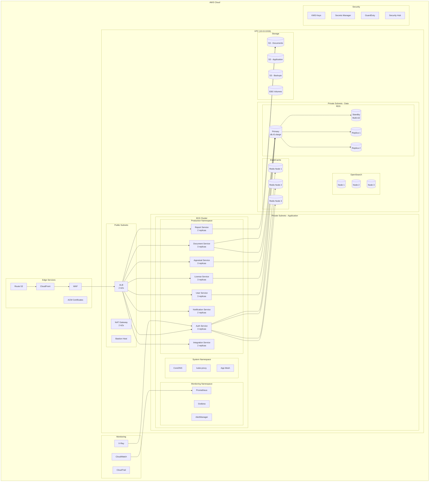
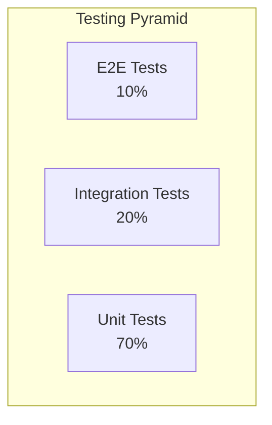

# Deliverable 21-30: Infrastructure & Operations
## Nelson Aczon License Broker & Appraiser Platform

**Document ID:** INFRA-001  
**Version:** 1.0  
**Status:** Draft  
**Last Updated:** 2026-07-22  
**Review Board:** DevOps, Database, QA, Software Architecture  

---

## 1. Document Overview

### 1.1 Purpose
This document defines the infrastructure and operations strategy for the Nelson Aczon License Broker & Appraiser Platform. It covers disaster recovery, backup, monitoring, logging, CI/CD, infrastructure, deployment, testing, and release management.

### 1.2 Scope
- Disaster Recovery Plan
- Backup Strategy
- Monitoring Strategy
- Logging Strategy
- CI/CD Pipeline
- Infrastructure Diagram
- Deployment Strategy
- Testing Strategy
- Release Plan

---

## 2. Disaster Recovery Plan (DRP)

### 2.1 Recovery Objectives

| Metric | Target | Description |
|--------|--------|-------------|
| **RPO** | <1 hour | Maximum data loss acceptable |
| **RTO** | <4 hours | Maximum downtime acceptable |
| **MTTR** | <30 minutes | Mean time to recovery |
| **MTBF** | >720 hours | Mean time between failures |

### 2.2 Disaster Scenarios

| Scenario | Probability | Impact | Recovery Strategy |
|----------|-------------|--------|-------------------|
| **Single AZ Failure** | Medium | High | Multi-AZ failover |
| **Region Failure** | Low | Critical | Cross-region failover |
| **Database Failure** | Low | Critical | Automated failover |
| **Application Failure** | Medium | Medium | Auto-restart/rollback |
| **Network Failure** | Low | High | Redundant paths |
| **Security Breach** | Low | Critical | Incident response plan |

### 2.3 Recovery Procedures

#### 2.3.1 Database Recovery
```yaml
Automated Recovery:
  - RDS Multi-AZ: Automatic failover (<2 minutes)
  - Read Replicas: Promote to primary (<5 minutes)
  - Point-in-time Recovery: Restore to any point (<1 hour)

Manual Recovery:
  - Snapshot Restore: Latest snapshot (<30 minutes)
  - Cross-region Restore: From cross-region snapshot (<2 hours)
```

#### 2.3.2 Application Recovery
```yaml
Automated Recovery:
  - Kubernetes Pod Restart: <30 seconds
  - Horizontal Pod Autoscaler: <1 minute
  - Service Mesh Failover: <10 seconds

Manual Recovery:
  - Rollback Deployment: <5 minutes
  - Infrastructure Restore: <30 minutes
  - Full Environment Restore: <2 hours
```

### 2.4 Communication Plan

| Event | Notification | Escalation | Timeline |
|-------|--------------|------------|----------|
| **Incident Detected** | PagerDuty alert | On-call engineer | Immediate |
| **Severity Assessment** | Slack notification | Team lead | <15 minutes |
| **Recovery Started** | Status page update | Management | <30 minutes |
| **Recovery Complete** | All stakeholders | Executive team | <4 hours |

---

## 3. Backup Strategy

### 3.1 Backup Types

| Data Type | Backup Type | Frequency | Retention | Storage |
|-----------|-------------|-----------|-----------|---------|
| **PostgreSQL** | Full | Daily | 90 days | S3 (cross-region) |
| **PostgreSQL** | Incremental | Hourly | 7 days | S3 |
| **PostgreSQL** | WAL | Continuous | 7 days | S3 |
| **Redis** | RDB Snapshot | Hourly | 7 days | S3 |
| **Redis** | AOF | Continuous | 24 hours | EBS |
| **S3 Documents** | Versioning | Continuous | 90 days | S3 |
| **Elasticsearch** | Snapshot | Daily | 30 days | S3 |
| **Application Config** | Git | Every change | Indefinite | GitHub |

### 3.2 Backup Procedures

#### 3.2.1 Database Backup
```bash
# Automated RDS Backup
aws rds create-db-cluster-snapshot \
  --db-cluster-identifier nalbap-prod \
  --db-cluster-snapshot-identifier manual-backup-$(date +%Y%m%d)

# Point-in-time Recovery
aws rds restore-db-instance-to-point-in-time \
  --source-db-instance-identifier nalbap-prod \
  --target-db-instance-identifier nalbap-restore \
  --restore-time "2026-07-22T12:00:00Z"
```

#### 3.2.2 Document Backup
```bash
# S3 Cross-Region Replication
aws s3api put-bucket-replication \
  --bucket nalbap-documents \
  --replication-configuration '{
    "Rules": [{
      "Status": "Enabled",
      "Destination": {
        "Bucket": "arn:aws:s3:::nalbap-documents-dr"
      }
    }]
  }'
```

### 3.3 Backup Testing

| Test Type | Frequency | Procedure | Success Criteria |
|-----------|-----------|-----------|------------------|
| **Restore Test** | Monthly | Restore from backup | Data integrity verified |
| **DR Drill** | Quarterly | Full DR simulation | RTO/RPO met |
| **Backup Verification** | Daily | Checksum verification | 100% integrity |

---

## 4. Monitoring Strategy

### 4.1 Monitoring Stack

| Tool | Purpose | Configuration |
|------|---------|---------------|
| **Prometheus** | Metrics collection | 15s scrape interval |
| **Grafana** | Visualization | Dashboards per service |
| **AlertManager** | Alert routing | PagerDuty, Slack, Email |
| **Jaeger** | Distributed tracing | 1% sampling rate |
| **ELK Stack** | Log aggregation | Centralized logging |

### 4.2 Key Metrics

#### 4.2.1 Infrastructure Metrics
| Metric | Threshold | Alert Level |
|--------|-----------|-------------|
| CPU Usage | >80% for 5 min | Warning |
| Memory Usage | >85% for 5 min | Warning |
| Disk Usage | >80% | Warning |
| Network Latency | >100ms | Warning |
| Error Rate | >1% | Critical |

#### 4.2.2 Application Metrics
| Metric | Threshold | Alert Level |
|--------|-----------|-------------|
| API Response Time | >500ms (p95) | Warning |
| API Error Rate | >0.1% | Critical |
| Request Rate | <100 RPS | Warning |
| Queue Depth | >1000 | Warning |
| Cache Hit Rate | <80% | Warning |

#### 4.2.3 Business Metrics
| Metric | Threshold | Alert Level |
|--------|-----------|-------------|
| Active Users | <50% normal | Warning |
| Order Completion Rate | <90% | Critical |
| License Verification Failures | >5% | Critical |
| Payment Failures | >1% | Critical |

### 4.3 Alert Rules

```yaml
groups:
  - name: infrastructure
    rules:
      - alert: HighCPUUsage
        expr: cpu_usage_percent > 80
        for: 5m
        labels:
          severity: warning
        annotations:
          summary: "High CPU usage detected"
          
      - alert: HighMemoryUsage
        expr: memory_usage_percent > 85
        for: 5m
        labels:
          severity: warning
          
  - name: application
    rules:
      - alert: HighAPIErrorRate
        expr: rate(http_requests_total{status=~"5.."}[5m]) > 0.001
        for: 2m
        labels:
          severity: critical
          
      - alert: SlowAPIResponse
        expr: histogram_quantile(0.95, rate(http_request_duration_seconds_bucket[5m])) > 0.5
        for: 5m
        labels:
          severity: warning
```

### 4.4 Dashboards

| Dashboard | Metrics | Audience |
|-----------|---------|----------|
| **Infrastructure Overview** | CPU, Memory, Disk, Network | DevOps |
| **Application Performance** | Latency, Errors, Throughput | Engineering |
| **Business KPIs** | Users, Orders, Revenue | Management |
| **Security Events** | Auth failures, Suspicious activity | Security |
| **Database Performance** | Connections, Queries, Locks | DBA |

---

## 5. Logging Strategy

### 5.1 Log Levels

| Level | Usage | Retention |
|-------|-------|-----------|
| **ERROR** | System errors, exceptions | 90 days |
| **WARN** | Potential issues | 30 days |
| **INFO** | Business events | 30 days |
| **DEBUG** | Development debugging | 7 days |

### 5.2 Log Structure

```json
{
  "timestamp": "2026-07-22T12:00:00.000Z",
  "level": "INFO",
  "service": "license-service",
  "traceId": "abc123",
  "spanId": "def456",
  "userId": "user-uuid",
  "tenantId": "tenant-uuid",
  "message": "License verified",
  "metadata": {
    "licenseId": "license-uuid",
    "licenseNumber": "BR-12345",
    "state": "CA"
  }
}
```

### 5.3 Log Sources

| Source | Collection | Storage |
|--------|------------|---------|
| **Application Logs** | Fluentd | Elasticsearch |
| **Access Logs** | ALB | S3 |
| **Audit Logs** | Application | PostgreSQL |
| **Security Logs** | WAF, GuardDuty | CloudWatch |
| **Infrastructure Logs** | CloudWatch Agent | CloudWatch |

### 5.4 Log Retention

| Log Type | Hot Storage | Warm Storage | Cold Storage |
|----------|-------------|--------------|--------------|
| **Application** | 7 days | 30 days | 90 days |
| **Access** | 7 days | 30 days | 1 year |
| **Audit** | 30 days | 1 year | 7 years |
| **Security** | 30 days | 1 year | 7 years |

---

## 6. CI/CD Pipeline

### 6.1 Pipeline Architecture

```mermaid
graph LR
    subgraph "Source Control"
        GitHub[GitHub]
    end
    
    subgraph "CI Pipeline"
        Lint[Lint]
        Test[Test]
        Security[Security Scan]
        Build[Build]
    end
    
    subgraph "CD Pipeline"
        Staging[Deploy to Staging]
        Integration[Integration Tests]
        Performance[Performance Tests]
        Approval[Manual Approval]
        Production[Deploy to Production]
    end
    
    subgraph "Monitoring"
        HealthCheck[Health Check]
        Alerting[Alerting]
    end
    
    GitHub --> Lint
    Lint --> Test
    Test --> Security
    Security --> Build
    Build --> Staging
    Staging --> Integration
    Integration --> Performance
    Performance --> Approval
    Approval --> Production
    Production --> HealthCheck
    HealthCheck --> Alerting
```



### 6.2 Pipeline Stages

#### 6.2.1 Build Stage
```yaml
Build:
  - Checkout code
  - Install dependencies
  - Run linting (ESLint, Prettier)
  - Run type checking (TypeScript)
  - Run unit tests (Jest)
  - Run security scan (Snyk)
  - Build Docker image
  - Push to ECR
```

#### 6.2.2 Test Stage
```yaml
Test:
  - Deploy to test environment
  - Run integration tests
  - Run API tests
  - Run E2E tests (Cypress)
  - Run performance tests (k6)
  - Generate test reports
```

#### 6.2.3 Deploy Stage
```yaml
Deploy:
  - Deploy to staging
  - Run smoke tests
  - Manual approval gate
  - Deploy to production (blue-green)
  - Run health checks
  - Monitor for errors
  - Rollback if needed
```

### 6.3 Quality Gates

| Gate | Criteria | Owner |
|------|----------|-------|
| **Code Quality** | SonarQube rating >= A | Engineering |
| **Test Coverage** | >80% unit, >70% integration | QA |
| **Security Scan** | 0 critical/high vulnerabilities | Security |
| **Performance** | <500ms p95 latency | Performance |
| **Accessibility** | WCAG 2.1 AA compliance | UX |

### 6.4 Deployment Strategies

| Strategy | Use Case | Downtime |
|----------|----------|----------|
| **Blue-Green** | Major releases | Zero |
| **Canary** | Feature rollouts | Zero |
| **Rolling** | Regular updates | Zero |
| **Rollback** | Emergency fixes | <1 minute |

---

## 7. Infrastructure Diagram

### 7.1 AWS Infrastructure



### 7.2 Resource Sizing

| Resource | Specification | Quantity | Monthly Cost |
|----------|---------------|----------|--------------|
| **EKS Cluster** | Control plane | 1 | $73 |
| **EKS Nodes** | m5.xlarge (4 vCPU, 16GB) | 6 | $840 |
| **RDS PostgreSQL** | db.r5.xlarge (4 vCPU, 32GB) | 1 primary + 1 standby | $1,200 |
| **RDS Read Replicas** | db.r5.large (2 vCPU, 16GB) | 2 | $600 |
| **ElastiCache Redis** | cache.r5.large (2 vCPU, 13GB) | 3 | $450 |
| **OpenSearch** | m5.large.search (2 vCPU, 8GB) | 3 | $450 |
| **S3 Storage** | Standard | 1TB | $23 |
| **CloudFront** | 1TB transfer | 1 | $85 |
| **ALB** | Application Load Balancer | 1 | $22 |
| **NAT Gateway** | Per AZ | 2 | $65 |
| **Total** | - | - | ~$3,800 |

---

## 8. Deployment Strategy

### 8.1 Environment Strategy

| Environment | Purpose | Infrastructure | Data |
|-------------|---------|----------------|------|
| **Development** | Active development | Shared, smaller | Synthetic |
| **Staging** | Pre-production testing | Production-like | Anonymized |
| **Production** | Live system | Full production | Real data |

### 8.2 Deployment Process

```yaml
Deployment Steps:
  1. Code Review & Approval
     - Pull request reviewed
     - Automated checks pass
     - Minimum 2 approvals
  
  2. Build & Test
     - CI pipeline executes
     - All tests pass
     - Security scan clean
  
  3. Staging Deployment
     - Deploy to staging
     - Integration tests run
     - QA validation
  
  4. Production Deployment
     - Manual approval gate
     - Blue-green deployment
     - Health checks pass
     - Monitoring enabled
  
  5. Post-Deployment
     - Smoke tests
     - Performance monitoring
     - Error monitoring
```

### 8.3 Rollback Procedure

```yaml
Rollback Triggers:
  - Error rate >1% for 5 minutes
  - P95 latency >1 second for 5 minutes
  - Health check failures
  - Critical bug discovered

Rollback Steps:
  1. Detect issue (automated alert)
  2. Assess impact (on-call engineer)
  3. Initiate rollback (kubectl rollout undo)
  4. Verify rollback (health checks)
  5. Notify stakeholders (Slack, email)
  6. Post-mortem (within 24 hours)
```

---

## 9. Testing Strategy

### 9.1 Testing Pyramid



### 9.2 Test Types

| Test Type | Coverage Target | Tools | Frequency |
|-----------|-----------------|-------|-----------|
| **Unit Tests** | >80% | Jest, React Testing Library | Every commit |
| **Integration Tests** | >70% | Jest, Supertest | Every PR |
| **E2E Tests** | Critical paths | Cypress, Playwright | Daily |
| **Performance Tests** | All endpoints | k6, Artillery | Weekly |
| **Security Tests** | OWASP Top 10 | OWASP ZAP, Snyk | Weekly |
| **Accessibility Tests** | WCAG 2.1 AA | Axe, Lighthouse | Every PR |

### 9.3 Test Environment

| Environment | Database | External Services | Purpose |
|-------------|----------|-------------------|---------|
| **Unit** | In-memory | Mocked | Fast feedback |
| **Integration** | Test DB | Real/Test | Service integration |
| **E2E** | Test DB | Test instances | Full workflow |
| **Performance** | Production-like | Production-like | Load testing |

### 9.4 Test Data Management

| Strategy | Usage | Implementation |
|----------|-------|----------------|
| **Synthetic Data** | Development | Faker.js |
| **Anonymized Data** | Staging | Custom scripts |
| **Production Data** | Performance testing | Subset, anonymized |

---

## 10. Release Plan

### 10.1 Release Cadence

| Release Type | Frequency | Scope | Approval |
|--------------|-----------|-------|----------|
| **Major Release** | Quarterly | New features | Executive |
| **Minor Release** | Monthly | Enhancements | Product |
| **Patch Release** | As needed | Bug fixes | Engineering |
| **Hotfix** | Emergency | Critical fixes | On-call lead |

### 10.2 Release Process

```yaml
Release Process:
  1. Planning (2 weeks before)
     - Feature freeze
     - Release branch created
     - Testing begins
  
  2. Testing (1 week before)
     - QA validation
     - Performance testing
     - Security review
  
  3. Pre-release (2 days before)
     - Release notes
     - Documentation updated
     - Stakeholder notification
  
  4. Release Day
     - Deployment window (2-6 AM UTC)
     - Blue-green deployment
     - Health monitoring
     - Rollback ready
  
  5. Post-release (1 week after)
     - Monitoring
     - Bug fixes
     - Performance optimization
```

### 10.3 Release Checklist

| Task | Owner | Status |
|------|-------|--------|
| Code freeze | Engineering | Pending |
| QA sign-off | QA | Pending |
| Security review | Security | Pending |
| Performance test | Performance | Pending |
| Documentation | Tech Writing | Pending |
| Release notes | Product | Pending |
| Stakeholder notification | Product | Pending |
| Deployment | DevOps | Pending |
| Smoke tests | QA | Pending |
| Monitoring | SRE | Pending |

---

## 11. Review Board Assessment

### DevOps Team Review

| Reviewer | Status | Comments |
|----------|--------|----------|
| **Platform Engineer** | Pending | Infrastructure review |
| **Cloud Engineer** | Pending | Cloud architecture |
| **Kubernetes Engineer** | Pending | K8s configuration |
| **Docker Specialist** | Pending | Container design |
| **CI/CD Engineer** | Pending | Pipeline design |
| **SRE** | Pending | Reliability review |
| **Monitoring Engineer** | Pending | Monitoring strategy |

### Database Team Review

| Reviewer | Status | Comments |
|----------|--------|----------|
| **DBA** | Pending | Database operations |
| **Data Architect** | Pending | Data architecture |
| **Backup Recovery Engineer** | Pending | Backup strategy |
| **DB Performance Specialist** | Pending | Performance |

### QA Council Review

| Reviewer | Status | Comments |
|----------|--------|----------|
| **QA Director** | Pending | Testing strategy |
| **Automation Engineer** | Pending | Automation |
| **Performance Tester** | Pending | Performance testing |
| **Chaos Engineer** | Pending | Resilience testing |

---

## 12. ADR-010: Infrastructure Strategy

### Decision
Adopted AWS cloud-native infrastructure with Kubernetes orchestration.

### Context:
- Need for scalability and reliability
- Multi-tenant architecture
- Cost optimization required

### Consequences
+ Scalability and reliability
+ Managed services reduce ops burden
+ Cost-effective at scale
- Vendor lock-in
- Complexity
- Learning curve

### Status
Accepted

---

## 13. Document History

| Version | Date | Author | Changes |
|---------|------|--------|---------|
| 1.0 | 2026-07-22 | System | Initial draft |

---

**Next Review:** Standards & Governance (Deliverable 31-40)  
**Dependencies:** Architecture Diagrams, Non-Functional Requirements  
**Blockers:** DevOps Team validation required
